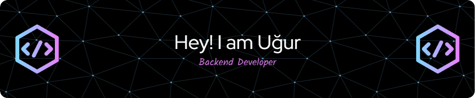

## 👋 Uğur Ayyıldız 

#### ✅ Linkler:

 

### 💻 Tech Stack:

 
 
 

### 💻 OS:

### 📊 GitHub Stats:
 
 

### 🏆 GitHub Trophies

### 🔝 Top Contributed Repo

---

<picture>
  <source
    media="(prefers-color-scheme: dark)"
    srcset="https://raw.githubusercontent.com/platane/snk/output/github-contribution-grid-snake-dark.svg"
  />
  <source
    media="(prefers-color-scheme: light)"
    srcset="https://raw.githubusercontent.com/platane/snk/output/github-contribution-grid-snake.svg"
  />
  
</picture>
<!-- Proudly created with GPRM ( https://gprm.itsvg.in ) -->

 
